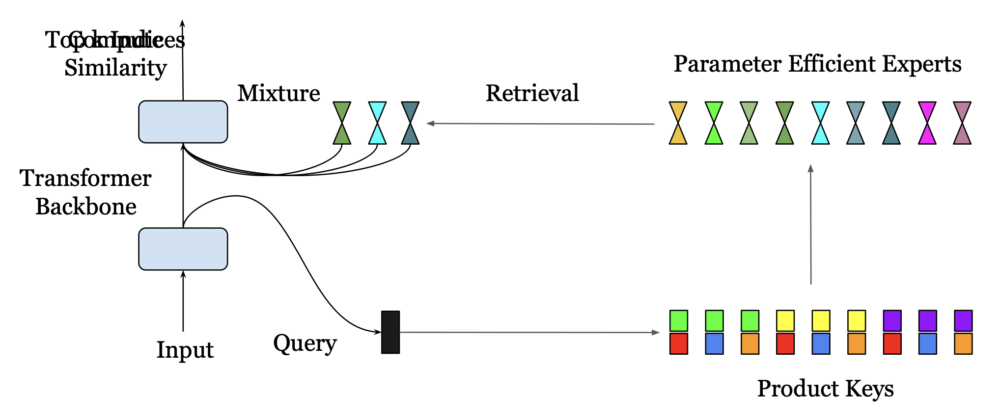

</img>

# PEER - Mixture of A Million Experts

## To do:
- [x] Complete the overview distributed training on wikitext-103
- [ ] Reproduce the results on wikitext-103 (comparing on dense model and MoE)
- [ ] Implement the model on other datasets
- [ ] Pre-training 1B model on Pile

Implementation of paper [Mixture of A Million Experts](https://arxiv.org/pdf/2407.04153v1) by Phan Nhat Huy

## How to run
```bash
torchrun --nproc_per_node=N --nnodes=1 main.py
```
## Training Process

Wikitext-103 2.2B model, 8 layers, 8 head, dimension = 256, 512x512 experts.


## Citations

```bibtex
@inproceedings{He2024MixtureOA,
    title   = {Mixture of A Million Experts},
    author  = {Xu Owen He},
    year    = {2024},
    url     = {https://api.semanticscholar.org/CorpusID:271038610}
}
```

## Acknowledgements

I thank the implementation of PEER layer from [lucidrains](https://github.com/lucidrains) https://github.com/lucidrains/PEER-pytorch
